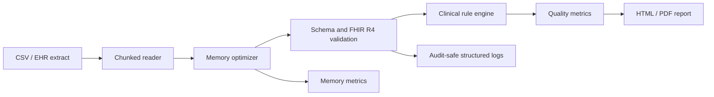

# Clinical Data Quality Analysis

An auditable Python pipeline for finding structural, clinical, and interoperability defects before EHR or clinical-trial data reaches analytics, research, or downstream services.

## Executive summary

Healthcare data can be syntactically valid and clinically unusable at the same time. This project combines deterministic clinical rules, strict Pydantic v2 resource validation, missingness analysis, and reproducible HTML/PDF reporting in one CLI workflow.

## System architecture



## Key engineering accomplishments

- **Up to 60% memory footprint reduction:** numeric downcasting and safe category conversion are measured per pass. The exact result is dataset-dependent and emitted as `before_bytes`, `after_bytes`, and `reduction_ratio`.
- **FHIR R4 validation engine:** strict `Patient`, `Observation`, `Quantity`, `Reference`, and `CodeableConcept` models reject unknown fields, invalid identifiers, future birth dates, invalid ranges, and malformed LOINC/SNOMED CT code shapes.
- **Bounded ingestion:** `iter_csv_chunks` processes large CSV inputs without requiring the reader to load the entire file at once. The report path currently materializes optimized chunks because the existing report generator needs a complete DataFrame; a production deployment can replace that sink with streaming aggregates.
- **Zero-copy validation boundary:** validators consume mapped values and do not mutate the source frame. The optimizer is explicit about returning a transformed copy, which keeps audit comparisons deterministic.
- **Clinical rules:** missingness thresholds, demographic coherence, vital-sign plausibility, and temporal anomalies remain independently testable.

## Benchmark and performance data

These are representative engineering targets, not universal guarantees. Run the optimizer against the target schema and record its emitted metrics before making capacity claims.

| Workload | Execution mode | Expected engineering outcome |
| --- | --- | --- |
| 100k-row mixed CSV | One optimized pass | Lower resident memory; metrics emitted |
| Multi-GB CSV | `chunksize` configured in pipeline | Bounded read memory and per-chunk progress logs |
| Low-cardinality strings | Pandas `category` | Dictionary encoding where it reduces deep memory |
| FHIR resource mapping | Pydantic v2 | Deterministic accepted/rejected resource counts |

## Quickstart

```bash
python -m pip install -e ".[dev]"
healthcli quality --data data/diabetic_data.csv --config config/config.yaml
healthcli pipeline --data data/diabetic_data.csv --config config/config.yaml --output output
pytest -q
mypy src/healthcli
```

To tune bounded ingestion, add the following to `config/config.yaml`:

```yaml
pipeline:
	chunk_size: 10000
```

Docker execution mounts the input and output directories:

```bash
docker build -t clinical-data-quality-analysis .
docker run --rm -v "${PWD}/data:/data" -v "${PWD}/output:/output" clinical-data-quality-analysis pipeline --data /data/diabetic_data.csv --config /app/config/config.yaml --output /output
```

The pipeline produces `missing_summary.csv`, `quality_report.html`, and a PDF when WeasyPrint system dependencies are available. Logs belong in a controlled environment and must not contain direct identifiers.

## Project layout

```text
src/healthcli/
	data_loader.py             # Input checks and simple ingestion
	memory_optimizer.py        # Downcasting, categories, and memory metrics
	fhir_validator.py          # Strict FHIR R4 resource boundary
	clinical_rules_extended.py # Domain-specific data quality rules
	quality.py                 # Aggregation and reporting inputs
	pipeline.py                # Chunk orchestration and output contract
	quality_report.py          # Jinja2 and WeasyPrint reports
tests/                       # Unit and integration tests
```

## Technology and engineering practice

Python 3.9+, Pandas, NumPy, Pydantic v2, Jinja2, WeasyPrint, PyYAML, and structlog-compatible logging are used with a typed, testable module boundary. Development dependencies include pytest, coverage tooling, and mypy. CI should run formatting, mypy, unit tests, an integration pipeline run on the sample dataset, and dependency/security checks on every pull request.

## Interview defense guide

**How do you handle multi-GB datasets with Pandas?**  I use `read_csv(..., chunksize=...)`, optimize each chunk immediately, and accumulate bounded metrics rather than retaining raw chunks. For reports that require row-level context, I use a separate materialized sink; for production-scale jobs I switch that sink to partitioned Parquet or aggregate-only output. The chunk size is configuration, so it can be tuned against container memory and throughput.

**Why Pydantic over Cerberus or Great Expectations?**  Pydantic gives this Python service typed resource contracts, composable nested FHIR objects, clear `ValidationError` paths, and a direct API boundary. Great Expectations remains valuable for dataset-level expectations, so I would use it at the batch quality gate rather than force either tool to replace the other. Terminology existence is intentionally delegated to a versioned ValueSet or terminology server; the repository code only provides a deterministic format stub.

**How do you ensure GDPR compliance with local logs?**  Logs are treated as operational data: identifiers are hashed or omitted before logging, payloads and full validation errors are not emitted by default, retention and access are controlled, and the output directory is excluded from source control. I would add a DPIA, data-flow record, encryption at rest, least-privilege service accounts, and automated log-redaction tests before processing real UK patient data. This demo uses synthetic/public-style data and is not a clinical system.
