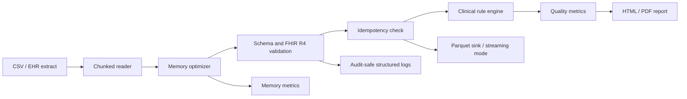
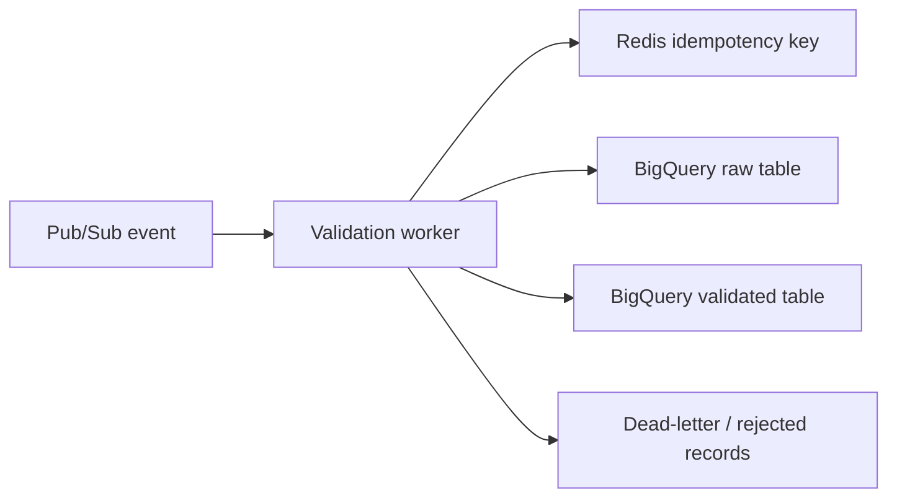

# Clinical Data Quality Analysis

An auditable Python pipeline for finding structural, clinical, and interoperability defects before EHR or clinical-trial data reaches analytics, research, or downstream services.

## Executive summary

Healthcare data can be syntactically valid and clinically unusable at the same time. This project combines deterministic clinical rules, a strict FHIR R4-inspired Pydantic v2 validation boundary, missingness analysis, and reproducible HTML/PDF reporting in one CLI workflow.

## System architecture



## Key engineering accomplishments

- **Measured memory optimization:** numeric downcasting and safe category conversion are measured per pass. Running the pipeline against `data/diabetic_data.csv` (101,766 rows, mostly low-cardinality categorical columns) achieved a 96.3% reduction; results are schema- and data-dependent -- a mostly-numeric or high-cardinality dataset will see far less -- and emitted as `before_bytes`, `after_bytes`, and `reduction_ratio` so any claim can be re-measured against the target schema.
- **FHIR R4-inspired validation boundary:** strict `Patient`, `Observation`, `Quantity`, `Reference`, and `CodeableConcept` models reject unknown fields, invalid identifiers, future birth dates, and malformed LOINC/SNOMED CT code shapes. This is not a complete FHIR conformance validator.
- **Dataset-level schema validation:** a versioned schema contract (`config/schema.yaml`) checks required columns, declared types, and controlled-vocabulary membership before clinical rules run. Errors are structured counts (`missing_columns`, per-column `field_errors`) -- rejected cell values are never included, so results are safe to log directly.
- **Streaming ingestion:** `healthcli pipeline --streaming` writes each optimized chunk straight to a Parquet sink and accumulates missingness metrics incrementally, with no `pd.concat` and no full in-memory DataFrame at any point. The original materialized path (needed for the row-level HTML/PDF report) remains available as the default.
- **Deterministic idempotency:** a SHA-256 dataset content hash, combined with the schema version and pipeline version, identifies a processing run; a canonical per-row hash detects duplicate records within it. A JSON processing manifest persists which row hashes have already been processed, so re-running an unchanged dataset reports rows as already-processed instead of duplicating output. No raw identifier is ever used as a manifest or log key.
- **Typed worker integration contract:** `healthcli.contracts` defines `ProcessingRequest`/`ProcessingResult` Pydantic models and a `RecordSink` Protocol so an external event-driven worker (e.g. `healthcare-data-pipeline`) can invoke clinical validation without importing Pub/Sub, Redis, or BigQuery clients into this repository. See [Integration contract](#integration-contract-for-external-workers) below.
- **Non-mutating validation:** validators consume mapped values without mutating the input frame. The optimizer intentionally returns a transformed copy, preserving a deterministic comparison boundary.
- **Clinical rules:** missingness thresholds, demographic coherence, vital-sign plausibility, and temporal anomalies remain independently testable.

## Benchmark and performance data

These are representative engineering targets, not universal guarantees. Run the optimizer against the target schema and record its emitted metrics before making capacity claims.

| Workload | Execution mode | Expected engineering outcome |
| --- | --- | --- |
| `data/diabetic_data.csv` (101,766 rows, mostly categorical) | One optimized pass | 96.3% measured memory reduction |
| Mostly-numeric or high-cardinality CSV | One optimized pass | Little to no reduction -- category conversion only helps low-cardinality strings |
| Multi-GB CSV | `chunksize` configured in pipeline, `--streaming` for Parquet output | Incremental reads; `--streaming` avoids the final `pd.concat` |
| Low-cardinality strings | Pandas `category` | Dictionary encoding where it reduces deep memory |
| FHIR resource mapping | Pydantic v2 | Deterministic accepted/rejected resource counts |

`scripts/benchmark_streaming.py` measures materialized vs. `--streaming` mode on a synthetic 1,000,000-row dataset (7 columns, no real patient data). One representative run on this machine: both modes processed ~18,000-20,000 rows/sec (~50-55s total), with peak RSS in the 195-210MB range for either mode -- at this row count and column width, the per-process pandas/pyarrow baseline dominates over the size of the materialized DataFrame itself, so the two modes are close on memory. Streaming mode's actual benefit is architectural, not a memory win at this scale: it removes the single-DataFrame ceiling entirely, so a dataset larger than available RAM (multi-GB, tens of millions of rows) can still be processed, which the materialized path cannot do regardless of chunk size. Re-run the script against your own target schema and row count before making a capacity claim; `--rows` and `--chunk-size` are configurable.

## Quickstart

```bash
python -m pip install -e ".[dev]"
healthcli quality --data data/diabetic_data.csv --config config/config.yaml
healthcli pipeline --data data/diabetic_data.csv --config config/config.yaml --output output
healthcli pipeline --data data/diabetic_data.csv --config config/config.yaml --output output --streaming
ruff check src tests examples scripts
pytest -q
mypy src/healthcli
python scripts/benchmark_streaming.py --rows 1000000
python examples/worker_integration.py
```

`--streaming` writes each optimized chunk to `output/validated_records.parquet` and rejected-record metadata to `output/rejected_records.jsonl`, without materializing a full DataFrame; it skips the row-level HTML/PDF report, which needs the whole dataset. Omit the flag for the original materialized path.

To tune bounded ingestion, add the following to `config/config.yaml`:

```yaml
pipeline:
	chunk_size: 10000

schema:
	path: config/schema.yaml
	fail_on_invalid: true

idempotency:
	enabled: true
	manifest_path: output/processing_manifest.json
	hash_columns: [patient_nbr, gender, age, max_glu_serum, A1Cresult, change, diabetesMed]
```

Dataset-level schema validation runs before clinical rules, using the versioned column/type/vocabulary contract in `config/schema.yaml`. Idempotency, when enabled, hashes the input file plus schema and pipeline versions into a run identity, and persists processed row hashes to `manifest_path` so re-running an unchanged dataset does not duplicate validated output.

Docker execution mounts the input and output directories:

```bash
docker build -t clinical-data-quality-analysis .
docker run --rm -v "${PWD}/data:/data" -v "${PWD}/output:/output" clinical-data-quality-analysis pipeline --data /data/diabetic_data.csv --config /app/config/config.yaml --output /output
```

The pipeline produces `missing_summary.csv`, `quality_report.html`, and a PDF when WeasyPrint system dependencies are available. Logs belong in a controlled environment and must not contain direct identifiers.

## Integration contract for external workers

`src/healthcli/contracts.py` defines the stable boundary an external event-driven worker (for example, the separate `healthcare-data-pipeline` repository, which owns Pub/Sub delivery, Redis-backed idempotency, retries, and dead-lettering) uses to call this repository's clinical quality engine as a library:

- `ProcessingRequest` -- a typed, versioned unit of work (`request_id`, optional `schema_version`, a list of record dicts). Rejects unknown fields.
- `ProcessingResult` -- a typed outcome (`outcome: validated | rejected`, `validated_count`, `rejected_count`, `rejected_records`). `RejectedRecord` carries a row index, an error type, and a reason string -- never the original field values, so the result is safe to log or forward to a dead-letter store as-is.
- `process_request(request, schema_path)` -- validates every record against the same versioned schema contract used by the CLI (`config/schema.yaml`) and returns a `ProcessingResult`. It raises on infrastructure-level failures (e.g. an unreadable schema file); it does not raise for validation failures, which are represented as `REJECTED` records in the result instead.
- `RecordSink` (re-exported from `healthcli.sinks`) -- the `Protocol` a worker's output stage implements; `DataFrameSink` and `ParquetSink` in this repository are reference implementations.

Nothing in `healthcli.contracts` imports `google-cloud-pubsub`, `redis`, or `google-cloud-bigquery` -- those remain the calling worker's dependencies, not this engine's. `examples/worker_integration.py` demonstrates the intended call sequence (acquire idempotency -> `process_request` -> route by `outcome` -> ack) using local, in-memory fakes for Pub/Sub messages, a Redis-style idempotency store, and BigQuery validated/dead-letter tables, so it runs with no cloud credentials. `tests/test_contracts.py` covers the contract itself (valid records, rejected records, missing columns, JSON-serializability) using the same local-fakes approach, with no live GCP dependency.

This repository's own CLI (`healthcli quality` / `healthcli pipeline`) remains fully usable standalone -- the contract module is an additional entry point, not a replacement for local batch usage.

## Scope and planned production integrations

This repository currently implements a local, batch-oriented CSV pipeline, plus the typed contract above for external worker integration. Pub/Sub ingestion, Redis-backed idempotency *storage*, and BigQuery storage are **not implemented in this repository** and are not represented as completed capabilities -- they belong to the calling worker (see [Integration contract](#integration-contract-for-external-workers)). What this repository does implement natively is a local, file-based analogue of the same ideas: a SHA-256 dataset/row hash manifest (`healthcli.idempotency`) for batch-level idempotent re-runs, and a Parquet + JSON-lines rejected-record sink for streaming output. A production cloud deployment could evolve the current boundaries as follows:



The next engineering steps would be adopting the `ProcessingRequest`/`ProcessingResult` contract as the wire format for the Pub/Sub message body, using an `event_id` or content hash for idempotent retries (this repository's `RunIdentity`/`ProcessingManifest` is a local analogue of that idea), writing raw and validated records to separate BigQuery tables, and adding emulator-based integration tests.

## Project layout

```text
src/healthcli/
	data_loader.py             # Input checks and simple ingestion
	memory_optimizer.py        # Downcasting, categories, and memory metrics
	fhir_validator.py          # Strict FHIR R4 resource boundary
	schema_validator.py        # Dataset-level schema/type/vocabulary validation
	clinical_rules_extended.py # Domain-specific data quality rules
	quality.py                 # Aggregation and reporting inputs
	sinks.py                   # RecordSink Protocol, DataFrameSink, ParquetSink
	streaming_metrics.py       # Incremental missingness aggregation across chunks
	idempotency.py             # Dataset/row hashing and the processing manifest
	contracts.py               # Typed ProcessingRequest/ProcessingResult worker contract
	pipeline.py                # Chunk orchestration, streaming mode, and output contract
	quality_report.py          # Jinja2 and WeasyPrint reports
scripts/
	benchmark_streaming.py     # Materialized vs. streaming benchmark on synthetic data
examples/
	worker_integration.py      # Example worker using local Pub/Sub/Redis/BigQuery fakes
tests/                       # Unit and integration tests
```

## Technology and engineering practice

Python 3.9+, Pandas, NumPy, Pydantic v2, Jinja2, WeasyPrint, PyYAML, and `structlog` are used with a typed, testable module boundary. Development dependencies include pytest, coverage tooling, pandas stubs, mypy, and ruff. CI runs `ruff check`, tests with coverage, and mypy; formatting enforcement, security scanning, and cloud emulator integration tests remain recommended additions.

## Interview defense guide

**How do you handle multi-GB datasets with Pandas?**  I use `read_csv(..., chunksize=...)`, optimize each chunk immediately, and accumulate bounded metrics rather than retaining raw chunks. For reports that require row-level context, I use a separate materialized sink; for production-scale jobs I switch that sink to partitioned Parquet or aggregate-only output. The chunk size is configuration, so it can be tuned against container memory and throughput.

**Why Pydantic over Cerberus or Great Expectations?**  Pydantic gives this Python service typed resource contracts, composable nested FHIR objects, clear `ValidationError` paths, and a direct API boundary. Great Expectations remains valuable for dataset-level expectations, so I would use it at the batch quality gate rather than force either tool to replace the other. Terminology existence is intentionally delegated to a versioned ValueSet or terminology server; the repository code only provides a deterministic format stub.

**How do you ensure GDPR compliance with local logs?**  Logs are treated as operational data: identifiers are hashed or omitted before logging, payloads and full validation errors are not emitted by default, retention and access are controlled, and the output directory is excluded from source control. I would add a DPIA, data-flow record, encryption at rest, least-privilege service accounts, and automated log-redaction tests before processing real UK patient data. This demo uses synthetic/public-style data and is not a clinical system.
